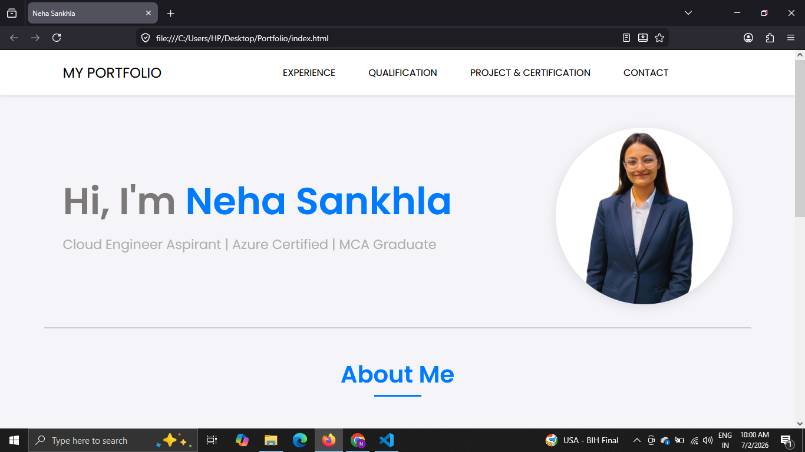
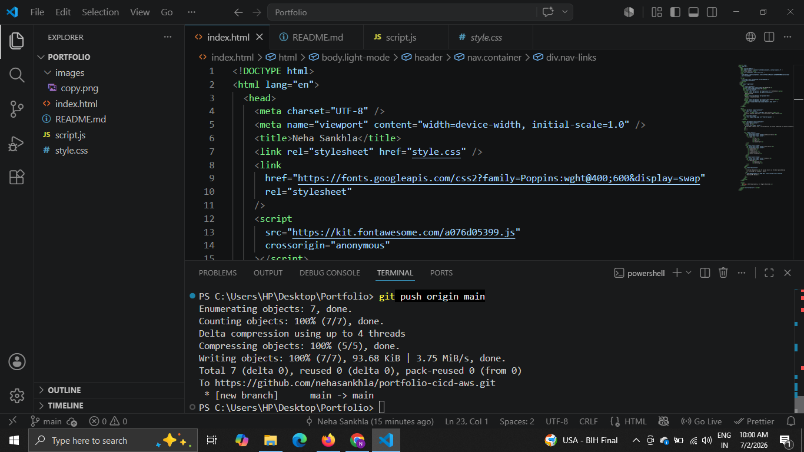
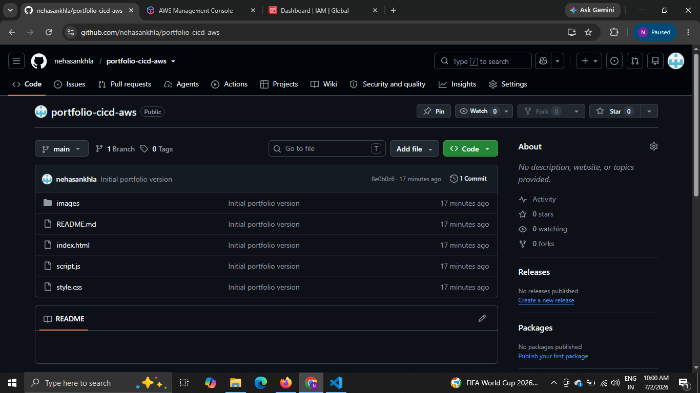
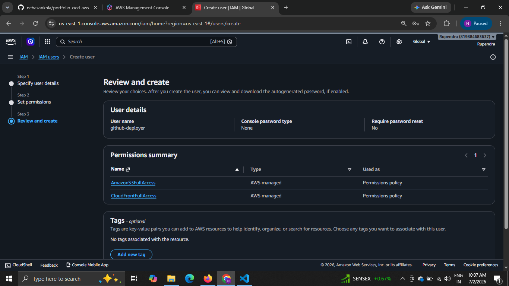
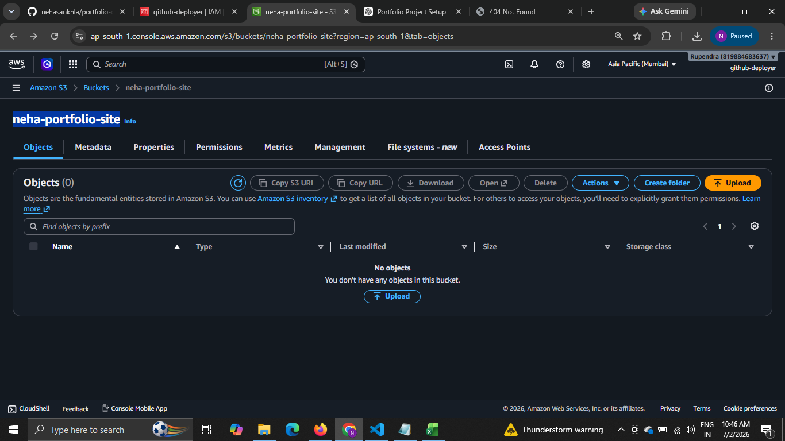
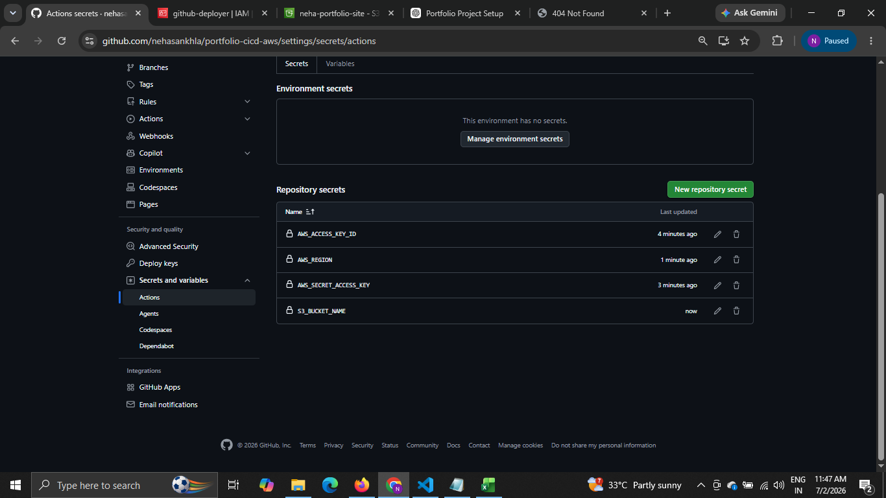
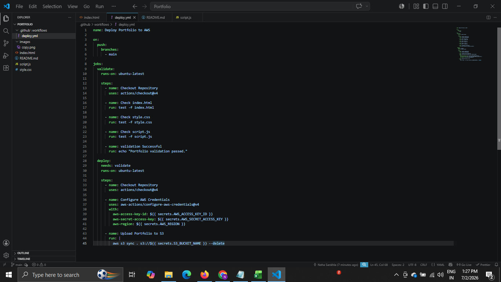
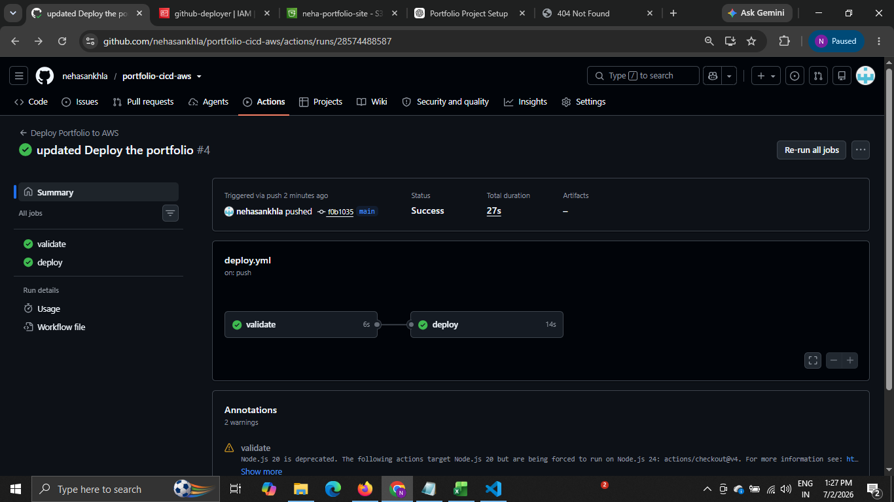
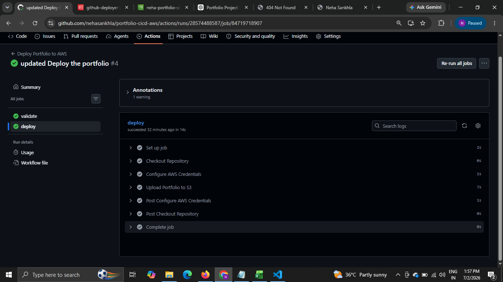
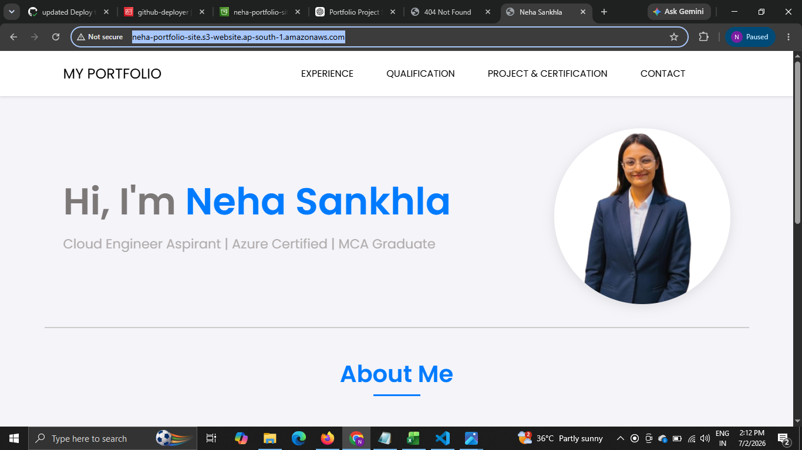

🚀 Portfolio CI/CD Deployment using GitHub Actions & AWS S3

# 📖 Project Overview

This project demonstrates a complete CI/CD pipeline for deploying a static portfolio website to Amazon S3 using GitHub Actions.
Whenever changes are pushed to the *main* branch, GitHub Actions automatically validates the project files and deploys the latest version to the Amazon S3 bucket.
The entire deployment process is automated, eliminating the need for manual uploads and ensuring faster, more reliable deployments.

# 🎯 Project Objectives

- Automate website deployment using GitHub Actions.
- Learn Continuous Integration and Continuous Deployment (CI/CD).
- Secure AWS authentication using IAM User and GitHub Secrets.
- Host a static portfolio website on Amazon S3.
- Understand real-world DevOps workflow.

# 🏗️ Project Architecture

Local Machine
      │
      ▼
Git Push
      │
      ▼
GitHub Repository
      │
      ▼
GitHub Actions
      │
      ▼
Validation Job
      │
      ▼
Deployment Job
      │
      ▼
AWS IAM Authentication
      │
      ▼
Amazon S3 Bucket
      │
      ▼
Live Portfolio Website

# 🛠️ Technologies Used

- HTML
- CSS
- JavaScript
- Git
- GitHub
- GitHub Actions
- YAML
- AWS IAM
- Amazon S3

# ✨ Features

- Automated CI/CD Pipeline
- Portfolio Validation
- Secure GitHub Secrets
- AWS IAM Authentication
- Automatic Deployment to Amazon S3
- Version Control using Git
- Zero Manual Upload

# 📂 Project Structure

Portfolio/
│
├── index.html
├── style.css
├── script.js
├── images/
│
├── .github/
│   └── workflows/
│       └── deploy.yml
│
└── README.md

# ⚙️ Workflow Explanation

## Step 1

Portfolio is developed on the Local Machine.

## Step 2

Code is pushed to GitHub Repository.

## Step 3

GitHub Actions workflow starts automatically.

## Step 4

Validation Job checks:

- index.html
- style.css
- script.js

If validation fails, deployment stops automatically.

## Step 5

GitHub securely authenticates with AWS using GitHub Secrets.

Secrets Used:

- AWS_ACCESS_KEY_ID
- AWS_SECRET_ACCESS_KEY
- AWS_REGION
- S3_BUCKET_NAME

## Step 6

Deployment Job uploads all website files to Amazon S3.

## Step 7

Portfolio becomes live on Amazon S3.

# 📸 Project Screenshots

## 1️⃣ Portfolio Running Locally

## 2️⃣ VS Code Project Structure

## 3️⃣ GitHub Repository

## 4️⃣ IAM User

## 5️⃣ Amazon S3 Bucket

## 6️⃣ GitHub Secrets

## 7️⃣ GitHub Actions Workflow

## 8️⃣ Validation & Deployment Successful

## 9️⃣ Deploy Logs

## 🔟 Uploaded Files in S3 Bucket

## 1️⃣1️⃣ Live Portfolio Website

# 🚀 CI/CD Pipeline Flow

Developer
     │
git add
git commit
git push
     │
     ▼
GitHub Repository
     │
     ▼
GitHub Actions
     │
     ▼
Validation
     │
     ▼
Deployment
     │
     ▼
Amazon S3
     │
     ▼
Portfolio Updated

# 🔒 GitHub Secrets Used

| Secret | Purpose |
|----------|----------|
| AWS_ACCESS_KEY_ID | AWS Authentication |
| AWS_SECRET_ACCESS_KEY | Secure Login |
| AWS_REGION | AWS Region |
| S3_BUCKET_NAME | Target Bucket |

# 📚 Key Learnings

- GitHub Actions
- CI/CD Pipeline
- YAML Workflow
- GitHub Secrets
- IAM User
- AWS Authentication
- Amazon S3 Static Website Hosting
- Workflow Validation
- Automated Deployment

# 🐞 Challenges Faced

- YAML Syntax Errors
- GitHub Secrets Configuration
- IAM Permission Issues
- S3 Bucket Policy Configuration
- Static Website Hosting Configuration
- Debugging GitHub Actions Workflow

# 🔮 Future Improvements

- Deploy using Amazon CloudFront
- Add Custom Domain
- HTTPS using AWS Certificate Manager
- Docker Integration
- Terraform Automation

# 👩‍💻 Author

**Neha Sankhla**

MCA Student | Aspiring Cloud & DevOps Engineer

